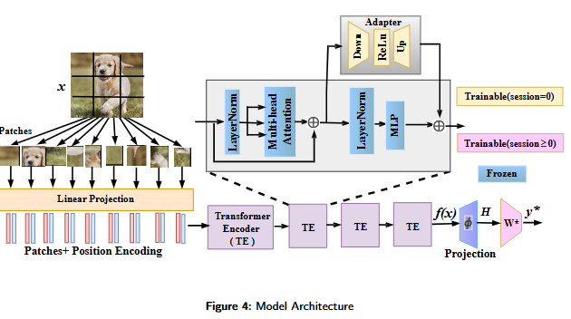

## Abstract




## Results


## Dependencies

1. torch 2.0.1
2. torchvision 0.15.2
3. timm 0.6.12
4. tqdm
5. numpy
6. scipy

## Run experiments

1. Run:
```
python main.py --config=./exps/ranpac.json
```
- Finetune the model (feature extractor) at first session-0 with ViT adapter, by selecting dataset and and making "resume": false.
- Then train classifier, by setting  (defualt NCM) /teen/ranpac/ranPress/loRP as true, and setting "resume": true. 
- Accordingly update the `exps/adam_adapter.json` to perform classification.


2. Hyper-parameters: You can edit the algorithm-speciifc hyperparameters in their respective json files.

## Acknowledgements

## Major part of the code including data loading pre-proccesing and defining backbone are taken from [FSCIL-calibration]
 ( https://github.com/dipamgoswami/FSCIL-Calibration)
The code is further based on the framework from [PILOT](https://github.com/sun-hailong/LAMDA-PILOT), [TEEN](https://github.com/wangkiw/TEEN) and [FeCAM](https://github.com/dipamgoswami/FeCAM).
